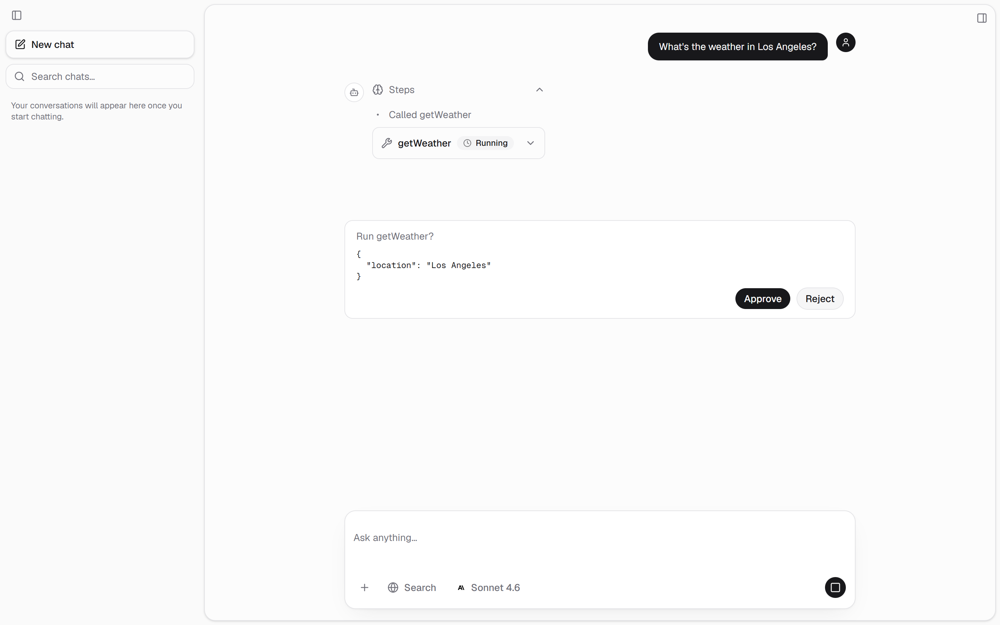
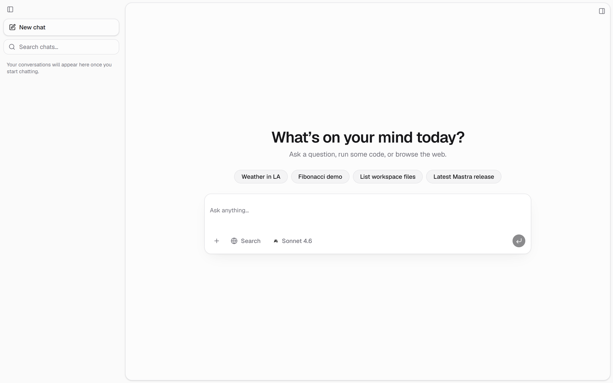

<div align="center">

# 💬 mastra-chat-kit

### The Mastra Agent Controller, wired to Vercel AI Elements.

**A chat frontend + agent backend where the hard part is already done: Mastra's Agent Controller emits ~50 orchestration events that a plain chat stream cannot carry — tool approvals, subagents, goals, plan modes, task tracking, observational memory, schedules, a live sandboxed workspace — and this kit maps every one of them onto the AI Element that renders it.**

Ships as a **shadcn registry**, so any project installs the same chat layer with one command instead of re-deriving the wiring.

[](LICENSE)
[]()
[](#-getting-started)
[](https://mastra.ai)
[](https://ai-sdk.dev)
[](https://turso.tech)

</div>


<div align="center"><sub>Sidebar │ chat │ workbench. The right rail is the agent's live workspace — Files, Terminal, Browser, Memory, Schedules.</sub></div>

---

## 💬 What a session looks like

The thing that makes this a *controller* and not a chat box: **the agent's work is visible and gated.** Tools do not silently run — they surface as a card and wait.

<details open>
<summary><b>"What's the weather in Los Angeles?"</b> — a tool call, paused for approval</summary>

<br>



Three things are on screen at once, each a different AI Element driven by a different controller event:

1. **Steps** — the agent's reasoning trace (`Called getWeather`)
2. **A live tool chip** — `getWeather` with its status, whose arguments streamed in token by token before the call settled
3. **The approval gate** — `Run getWeather?` with the exact arguments, and **Approve / Reject**

Nothing has executed yet. The controller run is parked server-side on an open SSE connection; approving resumes that same session, and the tool result flows back into the transcript.

</details>

<details>
<summary><b>"Use the code subagent to create hello.txt"</b> — delegation to a specialist</summary>

<br>

The chat agent recognises the intent and hands off to the **code** subagent — a real specialist with its own instructions, model, and tools, including a shell it can actually run commands in. The subagent's file write lands in the shared workspace, so the workbench's **Files** tab reflects it live, and the **Terminal** tab shows the shell output the run produced.

Same pattern for **research** (browse + search + cite), **writer** (long-form drafting), **review** (read-only audit), and **data** (versioned SQL).

</details>

> Both walkthroughs are from real runs against [AIMock](https://aimock.copilotkit.dev) fixtures, so the screenshots are reproducible with no API spend — see [Screenshots](#-screenshots). Wording varies with the model you point it at.

---

## 🎯 Why mastra-chat-kit?

- **✋ Approval-gated by default.** Every side-effecting tool pauses for approve / decline before it runs. HITL is the default posture, not a feature you bolt on.
- **🔌 ~50 controller events, already wired.** The gap between "an agent streams text" and "an agent shows you a plan, asks a question, delegates, and tracks its steps" is a lot of event plumbing. That's the part this kit is.
- **🧩 One chat layer, installed not copied.** `shadcn add` pulls the canonical shell into any project. Fixes flow out to consumers instead of drifting across forks.
- **🎭 Testable before it costs anything.** Unit, integration, component, and e2e tiers all run against deterministic AIMock fixtures. Real provider keys are absent by design, so an accidental live call fails loudly rather than billing you.
- **📦 Zero-friction storage.** Memory, threads, observability, and vector search all run on libSQL — a local `file:` DB in dev with no Docker and no server, a Turso URL in prod.
- **🔓 Provider-agnostic.** `CHAT_MODEL` is a `provider/model` string resolved by Mastra's model router — 600+ models across 40+ providers, one key via a gateway or one key per provider.

---

## 🧰 AgentController capabilities

Every capability is **agent-driven** — no manual buttons; the agent calls the right tool when it recognises the intent. Open **`/events`** in the app for the full event map with a copy-paste prompt per capability.

| Capability | What it does | Try it |
|---|---|---|
| **Tool approvals (HITL)** | Every side-effecting tool pauses for approve / decline before it runs. | *"What's the weather in Tokyo?"* |
| **Modes** (Chat / Plan) | The agent proposes a plan, then switches to Chat to execute it on approval. | *"Propose a plan to add a dark-mode toggle, then wait for approval."* |
| **Goals** | A standing objective the agent iterates toward; a judge scores each turn until it passes. | *"Keep refining a haiku about the ocean until it's excellent."* |
| **Subagents** | Delegates to a specialist — **code** (build/run in the sandbox), **research** (browse + search + cite), **writer** (long-form), **review** (read-only audit), **data** (versioned SQL, when Dolt is on) — each with its own instructions, model, and tools. | *"Use the code subagent to create hello.js that prints 1–10, then run it."* |
| **ask_user** | On a genuinely ambiguous request the agent asks *you* a question and resumes with the answer. | *"Deploy my app."* |
| **Task tracking** | Multi-step work rendered as a live checklist. | *"Plan and build a tiny counter in tracked steps."* |
| **Observational memory** | A background Observer distills durable facts across chats (the Memory panel). | *have a short back-and-forth* |
| **Schedules** | Recurring, persisted cron runs that survive a restart. | *"Remind me every morning to check the changelog."* |
| **Workspace** | A real filesystem + shell sandbox + browser the agent and its subagents drive. | *"Use the code subagent to create notes.txt."* |
| **Live tool streaming** | Tool arguments stream into an input-streaming Tool before the call settles. | *(fires on any tool call)* |
| **Semantic search** | The sidebar searches message bodies via a local embedding index. | *type in the sidebar search* |


---

## 📦 Install the chat layer

### Prerequisites — both are required

```bash
npx shadcn@latest init --base radix
```

Then confirm `components.json` says `"iconLibrary": "lucide"`.

| Requirement | Why | If you get it wrong |
|---|---|---|
| **`--base radix`** | The upstream Vercel AI Elements this kit depends on are authored against Radix and don't survive the CLI's Base UI transform. | 14 type errors, in upstream files |
| **`iconLibrary: lucide`** | Every component here imports `lucide-react`. On `hugeicons`, shadcn's own `ui/spinner.tsx` fails to typecheck. | 1 type error, failed build |

> A bare `npx shadcn@latest init` gives you **Base UI**, not Radix — since CLI 4.x, `--defaults` resolves to `--preset=base-nova`. This kit's own components port to either base fine (the CLI rewrites `asChild` to Base UI's `render`); it's the upstream elements that don't.

Verified end-to-end on shadcn CLI 4.16.0 / Next 16.2.6: with both prerequisites met, a fresh install typechecks with **0 errors** and `next build` **exits 0**.

### Install

Add the namespace to `components.json`, then install:

```jsonc
// components.json
"registries": { "@mastra-chat-kit": "https://mastra-chat-kit.vercel.app/r/{name}.json" }
```

```bash
npx shadcn@latest add @mastra-chat-kit/chat           # the full shell
npx shadcn@latest add @mastra-chat-kit/chat-minimal   # or the embeddable one
```

`chat` lands **34 files from this registry** — 9 shell components, the shared tool
renderers, 14 `app/api/*` proxy routes plus the proxy lib, the 4-file `chat-engine`,
and our 5 vendored AI Elements — plus the upstream AI Elements and shadcn/ui
primitives they resolve to.

Then mount a shell and point it at a server:

```tsx
import { ChatSwitcher } from '@/components/chat/chat-switcher';    // sidebar │ chat │ workbench
// or
import { MinimalChat } from '@/components/chat-minimal/minimal-chat'; // just the conversation
```

```bash
# .env.local
MASTRA_SERVER_URL=http://localhost:4111
```

The UI is **pure frontend** — it talks to a Mastra server over the same-origin route handlers it installed. Note that a stock `mastra dev` server does *not* expose the shape those routes expect; it serves Mastra's own `/api/agents/*`. This repo's `packages/server` registers the full contract and is the reference implementation. The 14-endpoint contract is in [`docs/registry.md`](docs/registry.md).

### One engine, swappable skins

The look and the engine are separate registry items, so you can change the first
without losing the second:

| Item | What it is |
|---|---|
| `chat-engine` | The brains — SSE client, transcript reducer, and the hooks that own every `/api/*` call. **UI-free: imports only React.** |
| `chat-tool-views` | Shared renderers turning real tool output into elements. Used by every skin. |
| `chat` · `chat-minimal` | Just the looks. Neither depends on the other. |

Both skins drive the **same** `AgentController` session — same threads, same tool
approvals, same subagents, same workspace. A third skin is one file rendering over
`useAgentControllerChat()`; `docs/registry.md` covers how, and the build fails if a
skin imports another skin or forgets a shared dependency.

Colors and fonts need no work: the registry ships **no** `cssVars`, so every skin
inherits your project's own shadcn theme.

> **Being straight about this:** `chat` and `chat-minimal` differ in *layout*, not
> yet in *visual style* — both render messages through the same AI Elements at
> default styling. The engine/skin split is real and tested; a skin with its own
> visual identity is still to come.

---

## 🎛️ The engine: Mastra's Agent Controller

Every capability above comes from one place.

| | |
|---|---|
| **Component** | `<ChatSwitcher />` — sidebar │ chat │ workbench |
| **Backend** | `AgentController` → `Session`; commands in, events out |
| **Route** | `POST /agent-controller/stream` (SSE) + `POST /agent-controller/approve` |
| **Web client** | `useAgentControllerChat` hook (command POST + SSE) |
| **Wire format** | `AgentControllerEvent`s → `AgentControllerDisplayState` |

It runs on Mastra's `AgentController` — the session controller Mastra's docs describe as handling *"managing conversation threads, switching between agent modes, persisting state, gating tool execution with approvals, and coordinating subagents."*

**→ [`docs/agent-controller.md`](docs/agent-controller.md)** covers the controller in full, using Mastra's exact vocabulary.

---

## 🧠 How it works

```
   Browser  ·  AI Elements + useAgentControllerChat  ·  packages/web (Next.js 16, :3000)
        │                                                                │
        ▼                                                                │
   POST /agent-controller/stream  (SSE)  ·  POST /agent-controller/approve                 │
        │                                                                │
        ▼                                                                │
   AgentController → Session                                             │
   modes · goals · approvals · subagents · tasks · workspace             │
   · schedules · follow-ups  →  AgentControllerEvents                    │
                      │                                                  │
                      ▼                                                  │
             packages/server  ·  Mastra + Hono (:4111)                  │
                      │                                                  │
                      ▼                                                  │
        LibSQLStore + LibSQLVector  ──  fastembed (local, 384-d)        │
        file: local  ·  libsql:// Turso prod                            │
        memory · threads · observability · semantic recall  ◀───────────┘
```

The controller wraps the `chatAgent`. Storage, threads, observability, and vector recall land in one libSQL database; embeddings run locally via `fastembed` (no embedding API).

---

## 🚀 Getting started

**Prerequisites:** Node.js 22+ · pnpm 10+ · one model provider key. **No Docker, no Postgres** — storage defaults to a local `file:` libSQL DB.

```bash
# 1. Install all workspace deps
pnpm install

# 2. Configure the server env
cp packages/server/.env.example packages/server/.env
#   Set APP_SECRET (openssl rand -hex 32) + model access. CHAT_MODEL is a
#   `provider/model` string resolved by Mastra's model router. Two ways to key it:
#     • GATEWAY (one key, every provider, swap models freely):
#         AI_GATEWAY_API_KEY     + CHAT_MODEL=vercel/…   (Vercel AI Gateway), or
#         MASTRA_GATEWAY_API_KEY + CHAT_MODEL=mastra/…   (Mastra Gateway)
#     • DIRECT (one key per provider):
#         ANTHROPIC_API_KEY + anthropic/…, OPENAI_API_KEY + openai/…, etc.
#   Leave TURSO_DATABASE_URL as-is for the local file: DB.

# 3. Run server (:4111) + web (:3000) together
pnpm dev
```

Open `http://localhost:3000` for the chat and `/events` for the controller event → element map, with a copy-paste prompt per capability.



<div align="center"><sub>First open. The suggested prompts each trigger a different controller capability; the workbench opens from the control in the top-right gutter.</sub></div>

**Zero-cost dev.** Run against AIMock instead of a real provider:

```bash
pnpm --filter @mastra-chat-kit/server dev:mock    # AIMock on :4010
# then set USE_AIMOCK=true in packages/server/.env and start the server
```

> **Loading env in dev:** a plain `.env` works everywhere. We inject secrets with **[Infisical](https://infisical.com)** instead of a committed file — `infisical run --path=/<project> -- pnpm dev` — so nothing sensitive lands on disk.

---

## 📸 Screenshots

Every image in this README is generated from the running app, not mocked up:

```bash
node packages/web/scripts/screenshot.mjs
```

It drives real AgentController sessions and captures the resulting UI. Read the header comment first — the live captures depend on a **freshly-wiped `packages/server/mastra.db`** and on scenario order, because the AIMock fixtures match on `turnIndex` (assistant messages in the request) and Mastra's semantic recall pulls earlier threads into later ones. The script refuses to write an image whose transcript shows bleed-through from another scenario rather than emitting a misleading one.

---

## 🧪 Testing — AIMock first

Every tier is **AIMock-backed, zero LLM spend** — real provider keys are intentionally absent, so an accidental real call fails loudly instead of billing you.

| Tier | Command | What it covers |
|---|---|---|
| **unit + integration** | `pnpm --filter server test` | Agent + AgentController flows via [AIMock](https://aimock.copilotkit.dev) — a `globalSetup` boots the mock on :4010 |
| **evals** | `pnpm --filter server eval` | `@mastra/evals` scorers (run with `USE_AIMOCK=true`) |
| **component** | `pnpm --filter web test` | AgentController reducer, transport + chat views, element rendering (Vitest + RTL) |
| **e2e** | `pnpm test:e2e` | Full chat flow (Playwright, AIMock-backed) |

`pnpm test` runs the unit/integration + component tiers across both packages. CI runs lint, both test suites, and a production web build on every PR — no secrets, no spend.

> **e2e note:** the Playwright config runs the web as a **production build** (`next build && next start`), not `next dev` — Turbopack's HMR socket breaks React hydration under headless Chromium.

---

## 🧱 Architecture

A two-package pnpm-workspaces monorepo: a Mastra + Hono **server** and a Next.js **web** frontend.

```
packages/
├─ server/                  Mastra + Hono agent server (:4111)
│  └─ src/
│     ├─ lib/env.ts           Zod-validated env — crashes on bad config
│     └─ mastra/
│        ├─ index.ts          Boot: env → AIMock → Mastra; AgentController routes
│        ├─ agents/           chat · code · research · writer · reviewer · data  (spawned as specialists)
│        ├─ lib/
│        │  ├─ agent-controller.ts  AgentController + Session
│        │  ├─ memory.ts        shared Memory: LibSQLVector + fastembed recall
│        │  └─ dolt.ts          optional versioned data, Git-style (mysql2)
│        └─ tools/            agent tools (getWeather, dolt, image, schedules …)
└─ web/                      Next.js 16 App Router + AI Elements (:3000)
   ├─ app/                     chat (/) + /events — the controller-event → element map
   ├─ components/chat/         full skin: sidebar · workbench (Files/Terminal/Browser/Memory/Schedules) · approvals
   ├─ components/chat-minimal/ second skin: conversation + composer only
   ├─ components/ai-elements/  vendored AI Elements (you own these files)
   ├─ lib/agent-controller/             the engine — SSE client, reducer, data hooks (UI-free)
   ├─ lib/agent-controller-event-map.ts the 50 events → elements + prompts (drives /events)
   └─ scripts/                 gen-registry.mjs (registry manifest) · screenshot.mjs
```

### Stack

| Layer | Technology |
|---|---|
| Agent framework | [Mastra](https://mastra.ai) — `@mastra/core` (Agent + AgentController + Workspace), `@mastra/memory`, `@mastra/ai-sdk`, `@mastra/evals`, `@mastra/observability`, `@mastra/editor`, `@mastra/mcp`, `@mastra/auth`, `@mastra/loggers` |
| AI SDK | [Vercel AI SDK **v7**](https://ai-sdk.dev) — `ai`, `@ai-sdk/react` (`useChat`) |
| Chat UI | [AI Elements](https://ai-sdk.dev/elements) (vendored, shadcn-style) + [shadcn/ui](https://ui.shadcn.com) — Radix base |
| Models | Any provider — `CHAT_MODEL` is a `provider/model` string resolved by [Mastra's model router](https://mastra.ai/models) (600+ models, 40+ providers). Gateway or direct keys both work. Image generation always uses OpenAI. |
| Storage + vectors | **[libSQL / Turso](https://turso.tech)** — `@mastra/libsql` (`LibSQLStore` + `LibSQLVector`); `file:` local, `libsql://` prod. [Postgres opt-in →](docs/postgres.md) |
| Embeddings | [fastembed](https://github.com/qdrant/fastembed) — local ONNX `bge-small` (384-d), no embedding API |
| Versioned data | [Dolt](https://www.dolthub.com) via `mysql2` (optional — the app boots without it) |
| API server | [Hono](https://hono.dev) (mounted via Mastra) |
| Frontend | [Next.js](https://nextjs.org) 16, [React](https://react.dev) 19, [Tailwind](https://tailwindcss.com) 4 |
| Testing | [Vitest](https://vitest.dev), [Playwright](https://playwright.dev), [AIMock](https://aimock.copilotkit.dev) |
| Linting | [Biome](https://biomejs.dev) |
| Monorepo | pnpm workspaces |

---

## 🗄️ Storage — libSQL / Turso by default

Memory, threads, and the vector index for semantic recall live in **libSQL** (native vector search — no separate vector service, no pgvector). Observability traces use **DuckDB** via a composite store, since Studio's Metrics/Logs need OLAP queries libSQL can't serve.

| Environment | `TURSO_DATABASE_URL` | Needs |
|---|---|---|
| **Local dev** | `file:./mastra.db` (default) | nothing — no server, no Docker |
| **Production** | `libsql://<db>-<org>.turso.io` + `TURSO_AUTH_TOKEN` | a [Turso](https://turso.tech) database |

Prefer Postgres (Supabase / Neon / RDS)? It's a small, self-contained swap — see **[`docs/postgres.md`](docs/postgres.md)**.

---

## 🕰️ Optional: versioned data (Dolt)

Separate from the app's own storage, the kit ships an **optional** integration with **[Dolt](https://www.dolthub.com)** — a SQL database that versions data the way Git versions code. It speaks the MySQL wire protocol, so it's a normal `mysql2` connection; the only special part is that every write ends in a `DOLT_COMMIT`.

It's **data-agnostic** — point it at whatever you'd want a history for:

| You put here… | …and versioning buys you |
|---|---|
| A **product catalog / price list** an agent edits | Undo a bad bulk change with one revert; `diff` exactly which rows moved |
| **Customer / CRM records** the agent updates | A full audit trail — who changed what, when — with author attribution |
| A **knowledge base / FAQ** the agent curates | Review its edits as a diff on a branch, merge only what you approve |
| **App config / feature flags** | Time-travel back to a known-good state after a regression |
| **Labeled datasets / eval results** | A branch per experiment, compared side by side |

Why version it: it gives an agent an **auditable, reversible database**. When an agent mutates data you don't just get the new value — you get a commit you can diff, view history on, time-travel to, branch, and roll back. That enables **"branch-per-agent → human merges"**: the agent proposes changes on its own branch, a human reviews the diff and merges. The agent never knows it's a versioned DB — it just calls the `doltQuery` / `doltWrite` tools.

**Off by default.** With no `DOLT_HOST` / `DOLT_PORT` set, the tools and boot-time bootstrap don't activate and the app runs entirely on libSQL.

---

## 🔭 Inspect & tune the agents (Mastra Studio)

The server runs on [Mastra](https://mastra.ai), so you can open it in **Mastra Studio** — a browser dashboard for the agents without the web app.

```bash
pnpm --filter @mastra-chat-kit/server dev    # server + Studio → http://localhost:4111
```

- 💬 **Chat** with the agents directly (uses your configured `CHAT_MODEL`)
- ✏️ **Edit & version** system prompts (draft/publish) via `@mastra/editor`
- 🧰 **Tools** — browse every tool the agent can call and invoke it by hand
- 🧠 **Memory & threads** — working memory + every conversation, persisted to libSQL
- 🧬 **Observational memory** — the durable, cross-chat facts the background Observer distills
- 🔭 **Traces** — per-run agent / tool / LLM spans
- ✅ **Scorers** — score runs against the eval datasets

---

## ☁️ Deployment

`mastra build` compiles the server into a self-contained Node app (`.mastra/output`) that runs on any Node/Bun/Deno host; `packages/server/Dockerfile` wraps it. The web app is a plain Next.js deploy. What decides the target is the agent's **workspace**: as shipped it uses **local** backends — `LocalFilesystem` + `LocalSandbox` (a real shell) + a Playwright browser — which want a persistent disk and a long-running process.

**Always-on Node host / container — recommended, minimal changes.**
Railway · Render · Fly.io · a VPS (Docker/Coolify) · AWS EC2 · DigitalOcean · Azure App Service. Point the build at `packages/server/Dockerfile`, set `TURSO_DATABASE_URL` + your keys.
- ✅ Server, memory/threads/vectors, the **filesystem + shell workspace**, **DuckDB traces**, and the **headless browser** all work with **no app-code changes**. The `Dockerfile` provisions Chromium — verified by launching it inside the built image as the non-root user.

**Serverless / edge — a real port, not drop-in.**
Vercel · Netlify · Cloudflare, via Mastra's deployers (added as `deployer:` on the Mastra instance — a code change). Serverless has no persistent disk or long-running process, so the **local workspace + browser + DuckDB don't run there**. Chat + memory + the model gateway work on the edge out of the box; to keep the **workspace**, swap its local backends for cloud ones in `workspace.ts` (`E2BSandbox` / `VercelSandbox` / `RailwaySandbox`, `S3Filesystem` / `GCSFilesystem`, a non-DuckDB observability store, Turso storage).

**Mastra Cloud — managed.**
`mastra auth`, then `mastra deploy --org <id> --project <name>` — gateway auto-seeded, managed libSQL provisioned. Deploy the Next.js web separately.

---

## ❓ FAQ

<details>
<summary><b>Does installing the registry give me the agent too?</b></summary>

No. The registry is **frontend-only** — chat components, the transport/controller client, and same-origin Next route handlers that proxy to a Mastra server at `MASTRA_SERVER_URL`. No agent code ships with it.

You bring a Mastra server that speaks the kit's endpoint contract. `packages/server` in this repo is the reference implementation; a stock `mastra dev` server won't match, since it serves Mastra's own `/api/agents/*` shape instead. The full 20-endpoint contract is in [`docs/registry.md`](docs/registry.md).
</details>

<details>
<summary><b>Do I have to use Radix? Why can't I use Base UI?</b></summary>

Radix is required, but not because of this kit's own code — our components import zero Radix packages and the shadcn CLI happily rewrites `asChild` to Base UI's `render` on install. The blocker is the **upstream Vercel AI Elements** this kit depends on: they're authored against Radix and don't survive that transform, producing 14 type errors on a Base UI project.

Supporting both bases and tracking upstream are mutually exclusive. We track upstream.
</details>

<details>
<summary><b>Can I run it without spending anything on a model?</b></summary>

Yes — that's the default posture for tests and it works for dev too. Every test tier runs against [AIMock](https://aimock.copilotkit.dev) fixtures, and `dev:mock` boots the same mock for interactive use. See the AIMock note under [Getting started](#-getting-started) for the two gotchas.
</details>

<details>
<summary><b>Can I use a different chat UI?</b></summary>

Yes. The engine (`chat-engine`) is UI-free — it owns the SSE transport, the transcript reducer, and every `/api/*` call, and imports nothing but React. A skin is rendering over one hook, so `chat` and `chat-minimal` both drive the same session and neither depends on the other. Colors and fonts need no work at all: the registry ships no `cssVars`, so any skin inherits your project's shadcn theme. See [`docs/registry.md`](docs/registry.md) for how to author one.
</details>

<details>
<summary><b>Do I need Docker, Postgres, or a vector service?</b></summary>

None of them. Storage, threads, observability, and vector search all run on libSQL — a local `file:` database in dev. Embeddings run locally via `fastembed`, so there's no embedding API either. Postgres is a documented opt-in ([`docs/postgres.md`](docs/postgres.md)), and Dolt is optional and off by default.
</details>

---

## 🤝 Contributing

Issues and PRs welcome. Two things worth knowing before you start:

- **This repo tracks work in [beads](https://github.com/gastownhall/beads)**, not GitHub issues. `bd ready` shows what's actionable; `bd show <id>` has the design notes. See [`CLAUDE.md`](CLAUDE.md).
- **Don't hand-edit `registry.json`.** It's generated: `pnpm --filter @mastra-chat-kit/web build:registry` parses the real imports of the shipped files, and a validation gate fails the build if a shipped file imports a module or fetches an `/api/*` route that no registry item ships. Edit `scripts/gen-registry.mjs` instead.

Before opening a PR, run what CI runs:

```bash
pnpm lint && pnpm test && pnpm --filter @mastra-chat-kit/web build
```

### Working against AIMock

**`USE_AIMOCK=true` has to be in `.env` — a shell variable won't take.** The server loads `packages/server/.env` *over* the process environment, so `USE_AIMOCK=true pnpm dev` silently runs against the real provider. (Same trap for `LOG_LEVEL`.) That single setting is all you need: `configureAIMock()` points every provider base URL at the mock and defaults the API keys to `mock`, so you don't add a key and you don't change `CHAT_MODEL` — verified with `openai/gpt-4.1-mini` and no `OPENAI_API_KEY` present at all.

The fixtures match on `turnIndex` (assistant messages in the request), and Mastra's semantic recall pulls earlier threads into later ones, so anything turn-sensitive wants a freshly-wiped `packages/server/mastra.db`.

---

## 🗺️ Roadmap

- 🎨 **A visually distinct skin.** `chat` and `chat-minimal` differ in layout but still render messages through the same elements at default styling, so they look alike. The engine/skin split is done and tested; a skin with its own visual identity is the part that isn't.
- 🧩 **Upstream the AI Elements patches.** Submitted to `vercel/ai-elements` and open at time of writing: [#456](https://github.com/vercel/ai-elements/pull/456) (agent) and [#457](https://github.com/vercel/ai-elements/pull/457) (code-block SSR), plus [#458](https://github.com/vercel/ai-elements/issues/458) and [#459](https://github.com/vercel/ai-elements/issues/459) for the two that change public types. Once merged we drop the local copies and depend entirely on upstream.

**Recently shipped:** the [registry is live](https://mastra-chat-kit.vercel.app) and installable · a nightly install smoke test builds a throwaway consumer project from the deployed registry · the chat engine is UI-free, so skins are swappable.

---

## 📚 Docs & references

**Mastra**
- [Get started](https://mastra.ai/docs) · [Agent reference](https://mastra.ai/reference/agents/agent)
- **[Model Router](https://mastra.ai/models)** — 600+ models across 40+ providers via one `provider/model` string · **[Environment variables](https://mastra.ai/models/environment-variables)** — which key each provider needs
- **[Agent Controller / AgentController](https://mastra.ai/reference/agent-controller/agent-controller-class)** — the session controller this kit runs on · [announcement](https://mastra.ai/blog/announcing-agent-harness)
- [Memory](https://mastra.ai/docs/memory/overview) · [Signals](https://mastra.ai/docs/agents/signals) — goals, task tracking, and observational memory all ride on the signal system

**Vercel AI SDK**
- [AI SDK](https://ai-sdk.dev) — the streaming layer · [AI Elements](https://ai-sdk.dev/elements) — the UI components this kit wires up

**This repo**
- [`docs/registry.md`](docs/registry.md) — what ships, the install prerequisites, the server contract
- [`docs/agent-controller-events.md`](docs/agent-controller-events.md) — every controller event → the element it drives (also live at **`/events`**)
- [`docs/coverage.md`](docs/coverage.md) · [`docs/agent-controller.md`](docs/agent-controller.md) · [`docs/ai-elements.md`](docs/ai-elements.md) · [`docs/postgres.md`](docs/postgres.md)

---

## 🙏 Acknowledgments

- **[Mastra](https://mastra.ai/)** — the agent framework: agents, AgentController, memory, evals, observability.
- **[Vercel](https://vercel.com/)** — the [AI SDK](https://ai-sdk.dev) and [AI Elements](https://ai-sdk.dev/elements) this chat layer is built from.
- **[Turso](https://turso.tech/)** — libSQL, the zero-friction storage + vector backend.
- **[Hono](https://hono.dev/)**, **[Next.js](https://nextjs.org/)**, and **[shadcn/ui](https://ui.shadcn.com/)** — server, frontend, and components.

---

## 📜 License

**[MIT](LICENSE).** © 2026 Otaku Solutions. Part of the Mastra kit lineage (sibling to `mastra-base` / `mastra-base-turso`). Questions: **hello@otakusolutions.io**.
