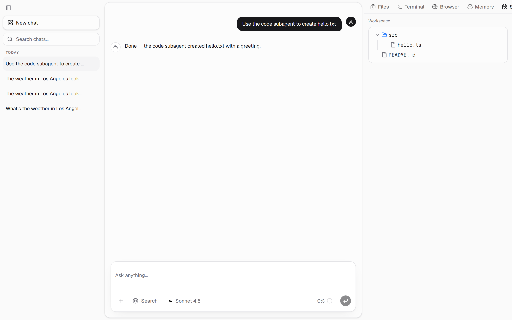
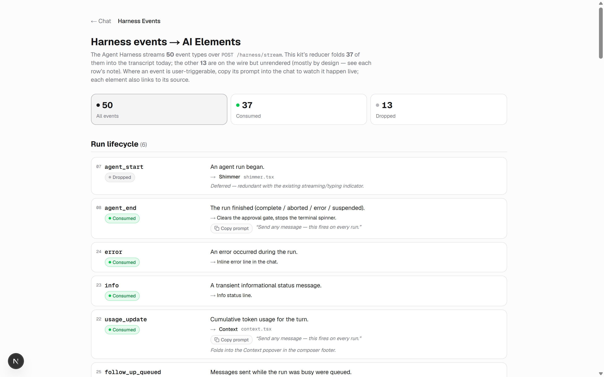

<div align="center">

# 💬 mastra-chat-kit

### The Mastra Agent Harness, wired to Vercel AI Elements. One UI, Agent mode or Harness mode.

**mastra-chat-kit is a production-grade chat frontend + backend that wires [Vercel AI Elements](https://ai-sdk.dev/elements) to the full [Mastra](https://mastra.ai) Agent Harness event stream — the hard part, done for you.** Built on the [AI SDK v7](https://ai-sdk.dev), it runs the *same* UI in **Agent mode** (a bare stateless agent) or **Harness mode** (a session-controlled `AgentController` with modes, goals, tool approvals, subagents, observational memory, schedules, and a live workspace). An in-app **`/events`** map lists every one of the 50 harness events, the AI Element it drives, and a copy-paste prompt to trigger it live. Ships as an **ai-elements / shadcn registry** so every project installs the same chat layer instead of drifting.

[](LICENSE)
[]()
[](#-getting-started)
[](https://mastra.ai)
[](https://ai-sdk.dev)
[](https://turso.tech)

</div>



---

## ⚡ What it is

One chat layer, built once, installed everywhere:

- **The whole harness surface, wired.** Mastra's Agent Harness emits ~50 orchestration events a bare chat stream can't carry — modes, goals, tool approvals (HITL), subagents, observational memory, recurring schedules, task tracking, live tool-input streaming, a sandboxed workspace. This kit folds each into the AI Element that renders it — the wiring you'd otherwise build by hand. The in-app **`/events`** map documents every event, the element it drives, and a copy-paste prompt to trigger it live.
- **Two engines, one UI.** The web layer talks to the server over a `ChatTransport`. Swap the transport and the *same* `useChat` + AI Elements run in **Agent mode** (stateless HTTP) or **Harness mode** (session SSE). Nothing in the UI changes.
- **AIMock-first.** Test everything before spending a cent — unit, integration, component, and e2e all run against deterministic [AIMock](https://aimock.copilotkit.dev) fixtures. A real provider is touched only at the final tier.
- **Ships as a registry.** `npx shadcn@latest add @mastra-chat-kit/chat` installs the canonical shell into any project. It depends on upstream AI Elements and overrides only the few components we patched.
- **Zero-friction storage.** Memory, threads, observability, and vector search all run on **libSQL/Turso** — a local `file:` DB for dev (no Docker, no server) and a `libsql://` Turso URL for prod. Postgres is a documented opt-in, not a requirement.

---

## 📦 Install the chat layer

Add the namespace to your `components.json`, then install:

```jsonc
// components.json
"registries": { "@mastra-chat-kit": "https://mastra-chat-kit.vercel.app/r/{name}.json" }
```

```bash
npx shadcn@latest add @mastra-chat-kit/chat
```

It pulls upstream [AI Elements](https://ai-sdk.dev/elements) and overrides only the components we patched (a tool-renderer registry, one approval component, the canonical chat shell). See [`docs/registry.md`](docs/registry.md) for the full design, the in-app **`/events`** page for the live harness-event → element map, and [`docs/coverage.md`](docs/coverage.md) for the end-to-end matrix.

---

## 🎛️ Two modes, one UI

The web layer is pure frontend. **Agent mode** drives `useChat` with `singleAgentTransport` (`lib/transports/single-agent.ts` → `DefaultChatTransport`); **Harness mode** swaps in the `useHarnessChat` hook (`lib/harness/`), which mirrors `useChat`'s `{ messages, sendMessage, status }` shape but speaks the Harness SSE protocol. The AI Elements above stay identical either way.

| | 🟢 **Agent mode** | 🟣 **Harness mode** |
|---|---|---|
| **Backend** | `agent.stream` → `toAISdkStream` → `createUIMessageStreamResponse` | `AgentController` → `Session`; commands in, events out |
| **Route** | `POST /chat/:agent` (HTTP) | `POST /harness/stream` (SSE) + `POST /harness/approve` |
| **Web client** | `useChat` + `singleAgentTransport` (`DefaultChatTransport`) | `useHarnessChat` hook (command POST + SSE) |
| **Wire format** | AI SDK `UIMessage` parts | `AgentControllerEvent`s → `AgentControllerDisplayState` |
| **Modes / approvals / subagents / model-switch / follow-ups** | n/a | first-class |

**Harness mode** runs on Mastra's `AgentController` — the session controller that Mastra's docs describe as handling *"managing conversation threads, switching between agent modes, persisting state, gating tool execution with approvals, and coordinating subagents."* (It was originally shipped as `Harness` and renamed to `AgentController` in `@mastra/core@1.47.0`; this kit keeps the `harness` name for its routes and files.) A **Session** drives the same `chatAgent`, tool calls pause for **approve / decline** (HITL) before running, and the web layer maps controller events onto the very same AI Elements.

**→ [`docs/modes.md`](docs/modes.md)** explains both modes in full, using Mastra's exact vocabulary — Session, Thread, Mode, tool approvals, subagents, and `AgentControllerDisplayState`.

---

## 🧰 Harness capabilities

Every capability is **agent-driven** (no manual buttons — the agent calls the right tool when it recognizes the intent) and wired to a real AI Element. Open **`/events`** in the app for the full event map with a copy-paste prompt per capability.

| Capability | What it does | Try it (Harness mode) |
|---|---|---|
| **Modes** (Chat / Plan) | The agent proposes a plan, then switches to Chat to execute it on approval. | *"Propose a plan to add a dark-mode toggle, then wait for approval."* |
| **Goals** | A standing objective the agent iterates toward; a judge scores each turn until it passes. | *"Keep refining a haiku about the ocean until it's excellent."* |
| **Subagents** | Delegates to a specialist from a roster — **code** (build/run in the sandbox), **research** (browse + search + cite), **writer** (draft long-form) — each a real specialist with its own instructions / model / tools. | *"Use the code subagent to create hello.js that prints 1–10, then run it."* |
| **Tool approvals (HITL)** | Every side-effecting tool pauses for approve / decline before it runs. | *"What's the weather in Tokyo?"* |
| **ask_user** | On a genuinely ambiguous request the agent asks *you* a question and resumes with the answer. | *"Deploy my app."* |
| **Task tracking** | Multi-step work rendered as a live checklist. | *"Plan and build a tiny counter in tracked steps."* |
| **Observational memory** | A background Observer distills durable facts across chats (the Memory panel). | *have a short back-and-forth* |
| **Schedules** | Recurring, persisted cron runs that survive a restart. | *"Remind me every morning to check the changelog."* |
| **Workspace** | A real filesystem + shell sandbox + browser the agent and its subagents drive. | *"Use the code subagent to create notes.txt."* |
| **Live tool streaming** | Tool arguments stream into an input-streaming Tool before the call settles. | *(fires on any tool call)* |
| **Semantic search** | The conversation sidebar searches message bodies via a local embedding index. | *type in the sidebar search* |

The **workbench** (right rail) surfaces the agent's workspace live: **Files · Terminal · Browser · Memory · Schedules**.



---

## 🧠 How it works

```
   Browser  ·  AI Elements + useChat  ·  packages/web (Next.js 16, :3000)
        │
        │  Agent = useChat + transport   ·   Harness = useHarnessChat hook
        ├─────────────────────────────┬────────────────────────────────┐
        ▼                             ▼                                 │
   Agent mode (HTTP)            Harness mode (SSE)                       │
   POST /chat/:agent           POST /harness/stream                     │
        │                             │                                 │
        ▼                             ▼                                 │
   agent.stream                 AgentController → Session               │
   → toAISdkStream              modes · approvals · subagents ·         │
   → UIMessage parts            model-switch · follow-ups → events      │
        └─────────────┬───────────────┘                                 │
                      ▼                                                  │
             packages/server  ·  Mastra + Hono (:4111)                  │
                      │                                                  │
                      ▼                                                  │
        LibSQLStore + LibSQLVector  ──  fastembed (local, 384-d)        │
        file: local  ·  libsql:// Turso prod                            │
        memory · threads · observability · semantic recall  ◀───────────┘
```

Both modes wrap the **same** `chatAgent`. Agent mode streams AI SDK `UIMessage` parts over HTTP; Harness mode streams `AgentControllerEvent`s over SSE. Storage, threads, observability, and vector recall all land in one libSQL/Turso database; embeddings run locally via `fastembed` (no embedding API).

---

## 🧪 Testing — AIMock first

Every tier is **AIMock-backed, zero LLM spend** — real provider keys are intentionally absent, so an accidental real call fails loudly instead of billing you.

| Tier | Command | What it covers |
|---|---|---|
| **unit + integration** | `pnpm --filter server test` | Agent + Harness flows via [AIMock](https://aimock.copilotkit.dev) — a `globalSetup` boots the mock on :4010 |
| **evals** | `pnpm --filter server eval` | `@mastra/evals` scorers (run with `USE_AIMOCK=true`) |
| **component** | `pnpm --filter web test` | Harness reducer, transport + chat views, element rendering (Vitest + RTL) |
| **e2e** | `pnpm test:e2e` | Full chat flow, both modes (Playwright, AIMock-backed) |

`pnpm test` runs the unit/integration + component tiers across both packages. No script hits a real provider yet — a real-model smoke tier is on the roadmap.

> **e2e note:** the Playwright config runs the web as a **production build** (`next build && next start`), not `next dev` — Turbopack's HMR socket breaks React hydration under headless Chromium.

---

## 🧱 Architecture

A two-package pnpm-workspaces monorepo: a Mastra + Hono **server** and a Next.js **web** frontend.

```
packages/
├─ server/                  Mastra + Hono agent server (:4111)
│  └─ src/
│     ├─ lib/env.ts           Zod-validated env — crashes on bad config
│     └─ mastra/
│        ├─ index.ts          Boot: env → AIMock → Mastra; Agent + Harness routes
│        ├─ agents/           chat · code · research · writer  (harness spawns the specialists)
│        ├─ lib/
│        │  ├─ harness.ts       AgentController + Session (Harness mode)
│        │  ├─ memory.ts        shared Memory: LibSQLVector + fastembed recall
│        │  └─ dolt.ts          optional versioned data, Git-style (mysql2)
│        └─ tools/            agent tools (getWeather, dolt, image, …)
└─ web/                      Next.js 16 App Router + AI Elements (:3000)
   ├─ app/                     chat (/) + /events — the harness-event → element map
   ├─ components/chat/         canonical shell · workbench (Files/Terminal/Browser/Memory/Schedules) · approvals
   ├─ components/ai-elements/  vendored AI Elements (you own these files)
   ├─ lib/transports/          single-agent.ts — Agent-mode DefaultChatTransport
   ├─ lib/harness/             use-harness-chat.ts + events — Harness-mode SSE client
   └─ lib/harness-event-map.ts the 50 events → elements + prompts (drives /events)
```

### Stack

| Layer | Technology |
|---|---|
| Agent framework | [Mastra](https://mastra.ai) — `@mastra/core` (Agent + AgentController + Workspace), `@mastra/memory`, `@mastra/ai-sdk`, `@mastra/evals`, `@mastra/observability`, `@mastra/editor`, `@mastra/mcp`, `@mastra/auth`, `@mastra/loggers` |
| AI SDK | [Vercel AI SDK **v7**](https://ai-sdk.dev) — `ai`, `@ai-sdk/react` (`useChat`), `@ai-sdk/anthropic`, `@ai-sdk/openai` |
| Chat UI | [AI Elements](https://ai-sdk.dev/elements) (vendored, shadcn-style) + [shadcn/ui](https://ui.shadcn.com) |
| LLM | Claude (Anthropic) — Sonnet 4.6 default, Opus 4.8 / Haiku 4.5 selectable; OpenAI models via allowlist |
| Storage + vectors | **[libSQL / Turso](https://turso.tech)** — `@mastra/libsql` (`LibSQLStore` + `LibSQLVector`); `file:` local, `libsql://` prod. [Postgres opt-in →](docs/postgres.md) |
| Embeddings | [fastembed](https://github.com/qdrant/fastembed) — local ONNX `bge-small` (384-d), no embedding API |
| Versioned data | [Dolt](https://www.dolthub.com) via `mysql2` (optional — the app boots without it) |
| API server | [Hono](https://hono.dev) (mounted via Mastra) |
| Frontend | [Next.js](https://nextjs.org) 16, [React](https://react.dev) 19, [Tailwind](https://tailwindcss.com) 4 |
| Testing | [Vitest](https://vitest.dev), [Playwright](https://playwright.dev), [AIMock](https://aimock.copilotkit.dev) |
| Linting | [Biome](https://biomejs.dev) |
| Monorepo | pnpm workspaces |

---

## 🚀 Getting started

**Prerequisites:** Node.js 22+ · pnpm 10+ · an Anthropic (or OpenAI) API key. **No Docker, no Postgres** — storage defaults to a local `file:` libSQL DB.

```bash
# 1. Install all workspace deps
pnpm install

# 2. Configure the server env
cp packages/server/.env.example packages/server/.env
#   Set APP_SECRET (openssl rand -hex 32) + model access. CHAT_MODEL is a `provider/model`
#   string resolved by Mastra's model router. Two ways to give it a key:
#     • GATEWAY (easiest — one key, every provider, switch models freely):
#         AI_GATEWAY_API_KEY     + CHAT_MODEL=vercel/…   (Vercel AI Gateway), or
#         MASTRA_GATEWAY_API_KEY + CHAT_MODEL=mastra/…   (Mastra Gateway) — swap anytime.
#     • DIRECT (one key per provider): ANTHROPIC_API_KEY + anthropic/…, OPENAI_API_KEY + openai/…
#   See https://mastra.ai/models/environment-variables. Leave TURSO_DATABASE_URL as-is for the local file: DB.

# 3. Run server (:4111) + web (:3000) together
pnpm dev
```

Open the web app at `http://localhost:3000` (chat) and `/events` (the harness event → element map, with a copy-paste prompt per capability). For deterministic, zero-cost dev, run the server against AIMock: `pnpm --filter server dev:mock`.

> **Loading env in dev:** a plain `.env` works everywhere. We personally inject secrets with **[Infisical](https://infisical.com)** instead of a committed file — `infisical run --path=/<project> -- pnpm dev` — so nothing sensitive lands on disk. Either way the app just reads them from the environment.

---

## 🗄️ Storage — libSQL / Turso by default

Memory, threads, and the vector index for semantic recall live in **libSQL** (native vector search — no separate vector service, no pgvector). Observability traces use **DuckDB** (an embedded OLAP store) via a composite store, since Studio's Metrics/Logs need OLAP queries libSQL can't serve.

| Environment | `TURSO_DATABASE_URL` | Needs |
|---|---|---|
| **Local dev** | `file:./mastra.db` (default) | nothing — no server, no Docker |
| **Production** | `libsql://<db>-<org>.turso.io` + `TURSO_AUTH_TOKEN` | a [Turso](https://turso.tech) database |

Prefer Postgres (Supabase / Neon / RDS)? It's a small, self-contained swap — see **[`docs/postgres.md`](docs/postgres.md)**.

---

## 🕰️ Optional: versioned data (Dolt)

Separate from the app's own storage (threads/memory/vectors on libSQL), the kit ships an **optional** integration with **[Dolt](https://www.dolthub.com)** — a SQL database that versions data the way Git versions code. It speaks the MySQL wire protocol, so it's a normal `mysql2` connection; the only special part is that every write ends in a `DOLT_COMMIT`.

It's **data-agnostic** — Dolt doesn't care what the rows *mean*. Point it at whatever you'd want a history for. The kit ships it as a generic capability, not a specific schema; you decide what lives there. A few concrete examples:

| You put here… | …and versioning buys you |
|---|---|
| A **product catalog / price list** an agent edits | Undo a bad bulk change with one revert; `diff` exactly which rows moved |
| **Customer / CRM records** the agent updates | A full audit trail — who changed what, when — with author attribution on every commit |
| A **knowledge base / FAQ** the agent curates | Review its edits as a diff on a branch, merge only what you approve |
| **App config / feature flags** | Time-travel back to a known-good state after a regression |
| **Labeled datasets / eval results** | A branch per experiment, compared side by side |

Why version it at all: it gives an agent an **auditable, reversible database**. When an agent mutates data — whatever that data represents in your app — you don't just get the new value; you get a commit you can **diff, view history on, time-travel to, branch, and roll back**. That enables a safe **"branch-per-agent → human merges"** pattern: the agent proposes changes on its own branch, a human reviews the diff and merges. The agent never knows it's a versioned DB — it just calls the `doltQuery` / `doltWrite` tools (`packages/server/src/mastra/tools/dolt.ts`), and every write is auto-committed with author attribution.

It's **fully optional** and **off by default** — with no `DOLT_HOST` / `DOLT_PORT` set, the tools and boot-time bootstrap don't activate and the app runs entirely on libSQL. Point it at a Dolt server (e.g. the compose stack / Coolify) to switch it on.

---

## 🔭 Inspect & tune the agents (Mastra Studio)

The server runs on [Mastra](https://mastra.ai), so you can open it in **Mastra Studio** — a browser dashboard for the agents without the web app.

```bash
pnpm --filter server dev    # server + Studio → http://localhost:4111
```

- 💬 **Chat** with the agents directly (uses your configured `CHAT_MODEL` — any provider)
- ✏️ **Edit & version** system prompts (draft/publish) via `@mastra/editor`
- 🧰 **Tools** — browse every tool the agent can call and invoke it by hand (weather, knowledge search, image gen, goals, schedules, workspace fs/shell, Dolt …)
- 🧠 **Memory & threads** — working memory + every conversation, persisted to libSQL
- 🧬 **Observational memory** — the durable, cross-chat facts the background Observer distills (in the Memory view)
- 🔭 **Traces** — per-run agent / tool / LLM spans
- ✅ **Scorers** — score runs against the eval datasets

---

## ☁️ Deployment

`mastra build` compiles the server into a self-contained Node app (`.mastra/output`, run with `node .mastra/output/index.mjs` or `mastra start`) that runs on any Node/Bun/Deno host; `packages/server/Dockerfile` wraps it. The web app is a plain Next.js deploy. What decides the target is the agent's **workspace**: as shipped it uses **local** backends — `LocalFilesystem` + `LocalSandbox` (a real shell) + a Playwright browser — which want a persistent disk and a long-running process.

**Always-on Node host / container — recommended, minimal changes.**
Railway · Render · Fly.io · a VPS (Docker/Coolify) · AWS EC2 · DigitalOcean · Azure App Service. Point the build at `packages/server/Dockerfile`, set `TURSO_DATABASE_URL` + your keys.
- ✅ Server, memory/threads/vectors (libSQL), the **filesystem + shell workspace**, and **DuckDB traces** all work with **no app-code changes**.
- ⚠️ The **headless browser** needs Chromium in the image — the Dockerfile doesn't install it yet. Add `playwright-core install chromium --with-deps` (browser + system libs) to enable browser tools; without it, everything else works and only a browser tool call fails.

**Serverless / edge — a real port, not drop-in.**
Vercel · Netlify · Cloudflare, via Mastra's deployers (`@mastra/deployer-vercel` / `-netlify` / `-cloudflare`, added as `deployer:` on the Mastra instance — a code change). Serverless has no persistent disk or long-running process, so the **local workspace + browser + DuckDB don't run there**. Chat + memory + the model gateway work on the edge out of the box; to keep the **workspace**, swap its local backends for **cloud** ones (a code edit in `workspace.ts`): a cloud **sandbox** that runs the shell remotely (`E2BSandbox`, `VercelSandbox`, `RailwaySandbox`, …), a cloud **filesystem** (`S3Filesystem`, `GCSFilesystem`, …), a non-DuckDB observability store, and Turso storage.

**Mastra Cloud — managed.**
`mastra auth`, then `mastra deploy --org <id> --project <name>` — gateway auto-seeded, managed libSQL provisioned. Deploy the Next.js web separately (e.g. Vercel).

The **web app** is plain Next.js — it goes anywhere Next.js runs. Turso's edge replication makes libSQL a natural fit for multi-tenant / edge.

---

## 🗺️ Roadmap

- 🌐 **Publish the registry** — host `@mastra-chat-kit` on Vercel so any project can `shadcn add` the chat layer.
- 🧩 **Upstream the AI Elements patches** — contribute the vendored fixes back to `vercel/ai-elements`.
- 🔁 **More clients** — add an IPC/desktop client (Electron) alongside the Agent-mode transport and the Harness SSE hook.
- 🧾 **Real-provider smoke tier** — a small opt-in test script that runs against a live model, gated behind an explicit key.

---

## 📚 Docs & references

The kit is built on **Mastra** (the agent framework + model router) and the **Vercel AI SDK** (the streaming + UI layer). The pages it leans on:

**Mastra**
- [Get started](https://mastra.ai/docs) · [Agent reference](https://mastra.ai/reference/agents/agent)
- **[Model Router](https://mastra.ai/models)** — 600+ models across 40+ providers via one `provider/model` string · **[Environment variables](https://mastra.ai/models/environment-variables)** — which key each provider needs · [announcement](https://mastra.ai/blog/model-router)
- **[Agent Harness / AgentController](https://mastra.ai/reference/agent-controller/agent-controller-class)** — the session controller Harness mode runs on · [announcement](https://mastra.ai/blog/announcing-agent-harness)
- [Memory](https://mastra.ai/docs/memory/overview) · [Signals](https://mastra.ai/docs/agents/signals) — goals, task tracking, and observational memory all ride on the signal system

**Vercel AI SDK**
- [AI SDK](https://ai-sdk.dev) — the streaming layer under the hood · [AI Elements](https://ai-sdk.dev/elements) — the UI components this kit wires up

**This repo**
- [`docs/harness-events.md`](docs/harness-events.md) — every harness event → the element it drives (also live in-app at **`/events`**)
- [`docs/coverage.md`](docs/coverage.md) · [`docs/modes.md`](docs/modes.md) · [`docs/ai-elements.md`](docs/ai-elements.md) · [`docs/registry.md`](docs/registry.md) · [`docs/postgres.md`](docs/postgres.md)

---

## 🙏 Acknowledgments

- **[Mastra](https://mastra.ai/)** — the agent framework: agents, AgentController, memory, evals, observability.
- **[Vercel](https://vercel.com/)** — the [AI SDK](https://ai-sdk.dev) and [AI Elements](https://ai-sdk.dev/elements) this chat layer is built from.
- **[Turso](https://turso.tech/)** — libSQL, the zero-friction storage + vector backend.
- **[Anthropic](https://www.anthropic.com/)**, **[Hono](https://hono.dev/)**, **[Next.js](https://nextjs.org/)**, and **[shadcn/ui](https://ui.shadcn.com/)** — models, server, frontend, and components.

---

## 📜 License

**[MIT](LICENSE).** © 2026 Otaku Solutions. Part of the Mastra kit lineage (sibling to `mastra-base` / `mastra-base-turso`). Questions: **hello@otakusolutions.io**.
